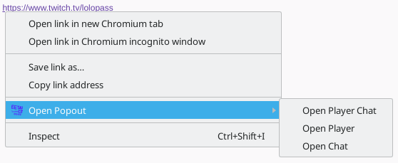
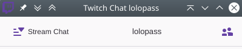
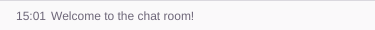
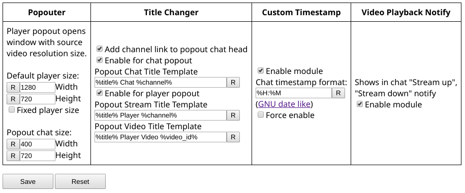

EET Addons & Utils
==================

Browser extension with addons and utils for Twitch viewers.

Popout context menu
---

Adds context menu to Twitch links.

Popout windows title changer
---

Changes title of chat and player popouts, also adds link to channel in chat header.

Custom Timestamps
---

Changes timestamp format, adds timestamp to notification in chat.

Video Playback Notify
---

Shows in chat "Stream up", "Stream down" notify.

Options
---

